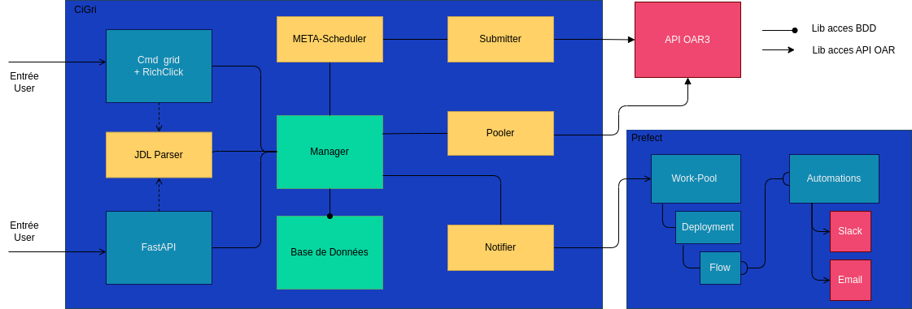
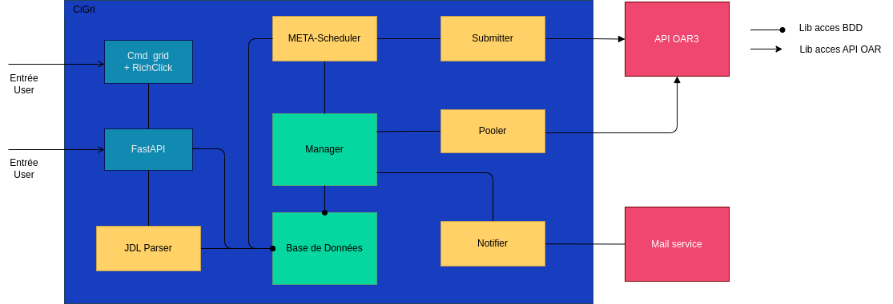
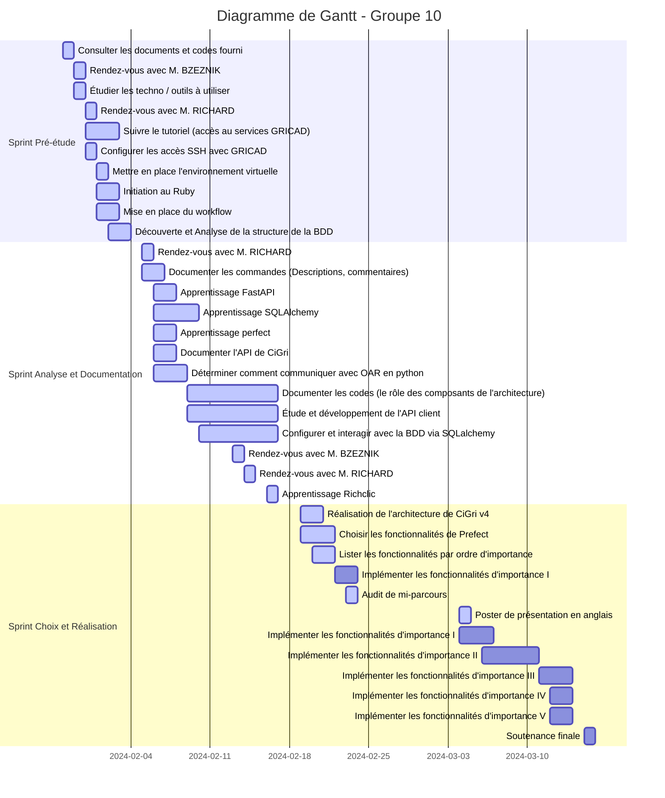

Killian GRICOURT
Antoine BONFILS
Tanguy DELAS
Diego CORREIA DE OLIVEIRA

# Rapport final Projet S10 - Groupe 10
# Développement d'un intergiciel de Grille de Calcul : CiGri v4

## Rappel du sujet/besoin et cahier des charges

Gricad propose des services pour la recherche grenobloise, notamment des supercalculateurs. Les scientifiques utilisent ces capacités de calcul pour effectuer des simulations, entraîner des modèles d'IA ou analyser des batchs de données.
Afin de pouvoir interagir avec les centres de calcul de la manière la plus efficace possible, le logiciel Cigri a été développé par Bruno Bzeznik depuis 2007. CiGri permet, à l'aide de quelques commandes seulement, de soumettre des centaines et même milliers de programmes, avec une notion de priorité pour utiliser les ressources en permanence.

Le cahier des charges contient toutes les fonctionnalités de la version actuelle, il n'est pas permis de créer un programme ayant des régressions. De plus, le logiciel doit être capable de communiquer avec les nouvelles versions des composants de l'architecture, comme OAR² en version 3. Le support d'OAR3 implique la gestion des jetons d'authentification JWT³ par CiGri.

## Technologies employées

Le logiciel CiGri v3 est codé en Ruby et est migrée vers Python. Afin de migrer CiGri en version Python, nous allons utiliser plusieurs librairies Python :

- Poetry : Gestionnaire de dépendance et d’environnement virtuel Python.
- SQLAlchemy : Permet de gérer les accès et les requêtes à la base de données SQL.
- Rich-Click : Permet d'ajouter simplement le support d'option de lancement en CLI à des commandes avec une interface plus user-friendly.
- FastAPI : Permet de mettre en place une API en Python.
- Uvicorn : Permet la mise en place d'un serveur web.

## Objectif du projet

L'objectif que nous nous sommes fixé en début de projet était de faire une application capable de remplacer Cigri pour son utilité la plus élémentaire : envoyer des jobs et recevoir les résultats. Ainsi, un utilisateur pourrait utiliser notre application de la même manière que Cigri v3 pour effectuer cette tâche. Cela ne permettrait pas de remplacer entièrement Cigri mais de fournir une base à un futur projet visant à effectivement remplacer la version actuelle de Cigri.

## Architecture techniques

En ce qui concerne l'architecture de la version Python de CiGri, nous avons décidé de nous inspirer de la version Ruby de CiGri. Les composants ont été adaptés aux librairies Python utilisées. De plus, nous avons adapté l'architecture afin de permettre un fonctionnement de l'application en local.

Ci-dessous se trouve 2 versions de l'architecture pour CiGri v4, une architecture inclus Prefect alors que l'autre ne l'inclut pas. Nous expliquerons par la suite les raisons qui nous ont poussées à en choisir l'une plutôt que l'autre.

### Architecture avec Prefect

Une partie importante de ce projet est de tester la viabilité de Prefect pour remplacer CiGri, tester s'il est possible d'adapter l'architecture actuelle pour utiliser Prefect.
Après une grande période de recherche, nous sommes rapidement arrivé à la conclusion qu'il ne serait pas possible d'utiliser exclusivement Prefect. En effet, pour utiliser pleinement Prefect, il faut remplacer toute l'installation actuelle pour réaliser des appels à Prefect. Cela implique notamment de recoder OAR ce qui n'est pas envisageable dans le temps disponible pour les projets S10.

Nous avons donc envisagé d'utiliser partiellement Prefect dans CiGri en l'utilisant comme une surcouche de CiGri comme illustré dans l'image ci-dessus. Dit autrement en conservant le comportement de CiGri v3 que l'on adapte en Python en rajoutant un front end avec Prefect. Cependant, cette version rajouterait beaucoup de complexité et de contrainte pour des résultats peu probants.
En effet, cela soulève la question de comment doit être réalisé l'accès à Prefect pour l'utilisateur. Il faudrait un compte par utilisateur, le problème étant que chaque compte a le droit à seulement un workspace Prefect. Il existe une contrainte de performance, car l'implémentation imposerait de mettre à jour l'ensemble des workspaces en parallèle, sachant qu'il y en aurait autant qu'il y a d'utilisateurs. Tout cela résulterait en des performances médiocres ainsi qu'une empreinte carbone élevée.
Dans le cas où l'on choisit d'avoir un seul compte pour tout le monde, on ajouterai une très grande faille de sécurité que l'on ne peut se permettre. De plus, Prefect permet de renseigner seulement un mail par utilisateur pour les notifications, ce qui entraîne l'impossibilité d'implémenter le système de notification par mail avec Prefect.

Pour terminer, il reste encore un point à prendre en compte, Prefect semble être mis en place pour des systèmes l'utilisant de A à Z pour en optimiser ses fonctionnalités et dans notre cas nous ne pouvons pas nous permettre de réimplémenter OAR. L'idée de l'utiliser partiellement semble donc peu envisageable.

Il est toutefois important de noter que des fonctionnalités premiums sont disponibles sur prefect et que nous ne nous sommes pas attardés dessus, car nous ne disposons pas de budget pour le projet. Pour ces raisons nous avons donc décidé de nous porter vers une migration plus classique du logiciel CiGri vers du Python avec l'architecture décrite dans la partie ci-dessous.

### Architecture sans Prefect

Expliquons le rôle de chacun des composants de CiGri v4 :

- Le JDL parser a pour rôle de parser les fichiers JDL⁵ et de les stocker en base de données.
- La base de données a pour rôle de stocker les données de l'application.
- Le manager est un gestionnaire d'événement, tout composant peut s'abonner et déclencher un événement, ceci permet de faire la jonction entre les composants de l'application en évitant un pooling constant entre les composants.
- Le Pooler a pour rôle de sonder périodiquement l'API d'OAR3 pour récupérer l'état des clusters¹, des jobs lancées, etc... Il est celui qui sait ce qui se passe du côté des clusters et il partage ses informations via des événements.
- Le notifier s'abonne à des événements et déclenche les envois de mails nécessaires.
- Le META-Scheduler est l'ordonnanceur de CiGri il est celui qui décide où, quand et en quelle quantité envoyer les jobs des campagnes à OAR3.
- Le submitter reçoit les jobs à envoyer avec les clusters cible et soumet les jobs.
- Le module FastAPI constitue l'API de CiGri et s'occupe de recevoir les requêtes utilisateurs et d'y répondre en réalisant les accès BDD nécessaires.
- Le composant Cmd grid + RichClick constitue les commandes exécutées par l'utilisateur (telles que gridstat, gridsub, etc...). Ces commandes réalisent des accès à l'API permettant ainsi d'avoir un client fonctionnant sur 2 machines distinctes.

## Réalisations techniques

Nous n'avons malheureusement pas pu réaliser le système entier étant donné la durée de la phase de recherche et de documentation de CiGri v3 par rapport au temps que nous avons a disposition. Nous avons donc réalisé certains modules de l'application :

- Le module d'interrogation de l'API d'OAR 3
- Les commandes gridclusters, gridsub, gridstat et griddel ont leur code traduit en Python
- L'API de CiGri possède une route implémenté entièrement
- La base de données est terminée
- Le JDL parser est lui aussi terminé
- Le manager est entièrement terminé
- Une version très très simplifié du scheduler

## Gestion de projet (méthode, planning prévisionnel et effectif, gestion des risques, rôles des membres ...)

En suivant la méthode Agile, nous effectuons des daily-meetings de 5 à 10 minutes afin de suivre l'avancement global du projet. Les ordres du jour sont consignés en rapports dans [le dépôt Github consacré à la documentation](https://github.com/2023-2024-PROJET-S10-G10/docs).
Le logbook, compte rendu de l'avancement des journées, est lui aussi consigné quotidiennement.

Le Gantt a été remanié plusieurs fois en début de projet, au fur et à mesure que les objectifs se sont éclaircis grâce aux réunions avec les porteurs de projet. L'un de nos regrets est de ne pas avoir pu organiser de réunion avec nos deux porteurs de projets tôt dans le projet.

Parmi les risques identifiés, on dénombre une prise de retard quant à l'implémentation des composants. Ainsi que la perte d'accès au centre de calcul. Pour y palier, nous restons en communication rapide avec Bruno Bzeznik via Slack.

Nous avons distingué 4 rôles particuliers en plus de celui de développeur: Le chef d’équipe, le scrum master, le tech lead et le responsable communication.
Nous nous sommes réparti ces rôles en fonction de nos appétences.
* Killian assure la fonction de chef d'équipe, incarnant ainsi le leadership au sein du groupe. 
* Antoine a pris en charge le rôle de Scrum Master, démontrant son engagement envers la méthodologie agile.
* Diego occupe la position de tech lead, apportant son expertise technique en Python.
* Tanguy se dédie à la responsabilité de la communication, s'occupant des différents échanges avec les porteurs de projet et autres.

## Outils (collaboration, CD/CI ...)

Afin d'entretenir un dialogue efficace avec Bruno Bzeznik, créateur de CiGri et porteur de projet de la version 4, nous avons rejoint le serveur Slack de Gricad. Nous pouvons ainsi facilement poser des question et organiser des réunions.

Nous avons mis en place un framework de test que nous utilisons pour lancer nos tests unitaires exécuté automatiquement et bloquant les merges avec la branche principale du dépôt git en cas de non réussite.
Ce dernier couplé à une obligation de review nous permet de s'assurer de la qualité de notre code et de sa non-régression à chaque PR (Pull Request).

Nous avons aussi utilisé poetry, un gestionnaire de dépendance pour pouvoir rester synchronisé sur les dépendances utilisées et ne pas avoir deproblèmes de version.

## Métriques logiciels : lignes de code, langages, performance, temps ingénieur (d'après vos journaux), la répartition des lignes de code et des commits en pourcentage entre les membres du projet ...)

| Membres                   | Commits dans le dépôt `app` (en nombre et en %) | Commits dans le dépôt `docs` (en nombre et en %) |
| ------------------------- | ----------- | ----------- |
| Killian GRICOURT          | 27  (48.2%) | 6  (15.8%)  |
| Antoine BONFILS           | 7   (12.5%) | 24  (63.2%) |
| Tanguy DELAS              | 6   (10.8%) | 0     (0%)  |
| Diego CORREIA DE OLIVEIRA | 16  (28.5%) | 8    (22%)  |

## Résultats 

Nous n'avons pas réussi à atteindre l'objectif que nous visions au début du projet. La version actuelle est composée de la majorité des composants de l'architecture dont la structure est bien définie. Très peu de fonctionnalités sont implémentées mais nous pouvons tout de même de faire communiquer certains composants entre eux. Malheureusement cela ne permet pas de sortir du cadre de tests à la main.

## Conclusion (Retour d'expérience)

Pour conclure, nous sommes d'accord sur le fait que nous avons manqué de temps sur ce projet. Une ou deux semaines supplémentaires nous auraient permis de proposer une application très sommaire mais tout de même utilisable pour les tâches les plus basiques. 

Toutefois, notre travail de recherche et notre exploration des différentes technologies nous auront permis de définir un cadre et une direction pour le développement de cette application. De plus, le dépôt git et son contenu ont été organisés de manière à ce que le projet puisse être repris tel quel par la suite.

## Glossaire

Cluster¹ : Ensemble de machines identiques, ayant les mêmes capacités de calcul. Individuellement, les serveurs sont appelés noeud ou node.
OAR² : L'ordonanceur en frontale des cluster. CiGri communique avec OAR pour soumettre et suivre l'état des jobs.
JWT³ : Pour JSON Web Token, c'est un jeton chiffré et délivré par OAR qui détenu uniquement par un chercheur ce qui permet de l'identifier.
Campagne : regroupement de jobs sur le même sujet, crée par un chercheur.
JDL⁵ : Pour Job Description Language, c'est un document au format JSON contenant des informations pour décrire la campagne et tout les paramètres des jobs à créer.

## Bibliographie

* https://www.sqlalchemy.org
* https://docs.prefect.io/latest/
* https://gricad-doc.univ-grenoble-alpes.fr
* https://www.ruby-lang.org/fr/