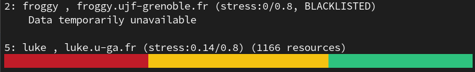

# Documentation des commandes `grid`

# PROJET S10 - Documentation des commandes `grid`

| Commandes |
|:---|
| [gridclean](#gridclean) | 
| [gridclusters](#gridclusters) | 
| [griddel](#griddel) | 
| [gridevents](#gridevents) | 
| [gridnotify](#gridnotify) | 
| [gridstat](#gridstat) | 
| [gridsub](#gridsub) | 

***

## gridclean

```bash
$ gridclean <CAMPAIGN_ID> [CAMPAIGN_IDS...] [options]
```

### Description

Cette commande permet d'afficher les id des jobs terminés des campagnes voulues. (d'après le code non achevé)

Plusieurs options sont disponibles :

    -v, --verbose                    Être verbeux
        --version                    Affiche la version de CiGri
    -h, --help                       Affiche l'aide en console

Exemple de sorties possibles :

```bash
$ gridclean 23163
/usr/local/share/cigri/bin/gridclean.rb:55: warning: assigned but unused variable - cluster_jobs
Getting the terminated jobs...
Sorting jobs by clusters...
Getting ["24231781", "24231954", "24232768", "24231783", "24231955", "24231951", "24231782", "24231594", "24231949", "24231593", "24231950", "24231595", "24231948", "24231960", "24231959", "24231958", "24231957", "24231962", "24231961", "24231952", "24231407"] from cluster 8...
```

### Commentaires

La récupération effective des travaux n'a pas été implémenté. De plus, l'option `-v, --verbose` n'a pas d'impacte sur la sortie.

***

## gridclusters

```bash
$ gridclusters [options]
```

### Description

Cette commande permet d'obtenir des informations sur les clusters disponibles sur gricad.

Plusieurs options sont disponibles :

        --version      Affiche le numéro de version
    -i, --infos        Affiche des informations sur chacun des clusters
    -I, --more_infos   Affiche plus de détails sur les clusters
    -u, --usage        Affiche l'utilisation de chaque cluster
    -b, --bars         Affiche les informations sous forme de barre
    -h, --help         Affiche l'aide en console

Exemple de sorties possibles :

```bash
$ gridclusters -i

2: froggy , froggy.ujf-grenoble.fr (stress:0/0.8, BLACKLISTED)
5: luke , luke.u-ga.fr (stress:0.16/0.8)
7: ceciccluster , ceciccluster.ujf-grenoble.fr (stress:0/0.8, BLACKLISTED)
8: dahu , f-dahu.u-ga.fr (stress:0.84/0.8, UNDER_STRESS)
9: bigfoot , bigfoot.u-ga.fr (stress:0.01/0.8)
```

```bash
$ gridclusters -I

2: froggy
    id: 2
    name: froggy
    api_url: https://froggy1.ujf-grenoble.fr/oarapi-cigri/
    api_auth_type: cert
    api_auth_header: X_REMOTE_IDENT
    ssh_host: froggy.ujf-grenoble.fr
    batch: oar2_5
    resource_unit: core
    power: 150
    properties: 
    stress_factor: 0/0.8
    api_chunk_size: 100
    enabled: t
    blacklisted: true
    under_stress: false
5: luke
    ...
```

```bash
$ gridclusters -u

2: froggy , froggy.ujf-grenoble.fr (stress:0/0.8, BLACKLISTED)
    Data temporarily unavailable
5: luke , luke.u-ga.fr (stress:0.24/0.8)
    max_resources: 1166
    used_resources: 459
    used_by_cigri: 8
    unavailable_resources: 362
...
```

```bash
$ gridclusters -b
```



### Commentaires


***

## griddel

```bash
$ griddel [options]
```

### Description

Cette commande permet de supprimer, suspendre et reprendre une campagne.

Plusieurs options sont disponibles :

    -c, --campaign_ids id1,id2,...   Campagnes sur lesquelles agir
    -p, --pause                      Mettre en arrêt la campagne
    -r, --resume                     Reprendre la campagne (seulement si il est en pause)
        --purge                      Purge la campagne (seulement si il est fini)
    -j, --job ID                     Annuler un seul job
    -v, --verbose                    Être verbeux
        --version                    Affiche la version de CiGri
    -h, --help                       Affiche l'aide en console

Exemple de sorties possibles :

```bash
$ griddel -p
```

```bash
$ griddel -r
```

### Commentaires

Les options `-j` et `--purge` retournent une erreur `400 Bad Request`.

Comme nous pouvons le voir dans les exemples de sorties, il manque les retours (feedback) des commandes exécutées.

***

## gridevents

```bash
$ gridevents [options]
```

### Description

Cette commande permet de gérer les événements, lister des événements d'une campagne donnée et de les corriger. 

Lorsqu'elle est utilisée pour corriger des événements, il peut lui être demandé de déclencher la relance automatique du ou des jobs corrigés.

Les événements permettent à l'utilisateur de lui fournir des informations sur l'arrêt du job (erreur syntaxique, fichier non trouvé, et autres). 

Plusieurs options sont disponibles :

    -c, --campaign ID                Affiche les événements pour cet ID de campagne ou les fermer (avec -f)
    -g, --global                     Affiche les événements globaux actuels (non spécifiques à une campagne)
    -e, --event ID                   Affiche uniquement cet événement ou le fermer (avec -f)
    -f, --fix                        Corrige / Ferme un événement (utilisé avec -e) ou tous les événements d'une campagne (utilisé avec -c)
    -r, --resubmit                   Resoumettre chaque travail concerné par les événements fixés (nécessite -f)
    -a, --all                        Affiche tous les événements, même ceux qui sont fermés. (Attention: Cela n'affiche pas les événements globaux actuels)
    -v, --verbose                    Être verbeux
        --version                    Affiche la version de CiGri
    -h, --help                       Affiche l'aide en console

Exemple de sorties possibles :

```bash
$ gridevents -c 23172
------------------------------------------------------------------------------
38309618: (open) EXIT_ERROR of job 56936429 at 2024-02-05T21:10:39+01:00 on luke
The job exited with exit status 256;
Last 5 lines of stderr_file:
  running command 'timedatectl' had status 1
There were 22 warnings (use warnings() to see them)
Error in `.rowNamesDF<-`(x, value = value) : invalid 'row.names' length
Calls: rownames<- ... row.names<- -> row.names<-.data.frame -> .rowNamesDF<-
Execution halted
------------------------------------------------------------------------------
38309619: (open) BLACKLIST at 2024-02-05T21:10:39+01:00 on luke because of 38309618
------------------------------------------------------------------------------
38309620: (open) EXIT_ERROR of job 56936428 at 2024-02-05T21:10:39+01:00 on luke
The job exited with exit status 256;
Last 5 lines of stderr_file:
  running command 'timedatectl' had status 1
There were 22 warnings (use warnings() to see them)
Error in `.rowNamesDF<-`(x, value = value) : invalid 'row.names' length
Calls: rownames<- ... row.names<- -> row.names<-.data.frame -> .rowNamesDF<-
Execution halted
------------------------------------------------------------------------------
38309621: (open) BLACKLIST at 2024-02-05T21:10:40+01:00 on luke because of 38309620
------------------------------------------------------------------------------
38309622: (open) EXIT_ERROR of job 56936427 at 2024-02-05T21:10:40+01:00 on luke
The job exited with exit status 256;
Last 5 lines of stderr_file:
  running command 'timedatectl' had status 1
There were 22 warnings (use warnings() to see them)
Error in `.rowNamesDF<-`(x, value = value) : invalid 'row.names' length
Calls: rownames<- ... row.names<- -> row.names<-.data.frame -> .rowNamesDF<-
Execution halted
------------------------------------------------------------------------------
38309623: (open) BLACKLIST at 2024-02-05T21:10:40+01:00 on luke because of 38309622
------------------------------------------------------------------------------
```

```bash
$ gridevents -e 38309622
------------------------------------------------------------------------------
38309622: (open) EXIT_ERROR of job 56936427 at 2024-02-05 21:10:40+01
The job exited with exit status 256;
Last 5 lines of stderr_file:
  running command 'timedatectl' had status 1
There were 22 warnings (use warnings() to see them)
Error in `.rowNamesDF<-`(x, value = value) : invalid 'row.names' length
Calls: rownames<- ... row.names<- -> row.names<-.data.frame -> .rowNamesDF<-
Execution halted
------------------------------------------------------------------------------
```

```bash
$ gridevents -g
------------------------------------------------------------------------------
34640560: (open) TIMEOUT at 2023-04-04T17:00:06+02:00 on froggy
GET https://froggy1.ujf-grenoble.fr/oarapi-cigri/stress_factor: REST query timeouted!
------------------------------------------------------------------------------
34640561: (open) BLACKLIST at 2023-04-04T17:00:06+02:00 on froggy because of 34640560
------------------------------------------------------------------------------
34669973: (open) SSL_ERROR at 2023-06-04T03:50:09+02:00 on ceciccluster
SSL_read: ssl handshake failure
------------------------------------------------------------------------------
34669974: (open) BLACKLIST at 2023-06-04T03:50:09+02:00 on ceciccluster because of 34669973
------------------------------------------------------------------------------
```

### Commentaires

L'option `-c` retourne une erreur dans certains cas, par exemple, nous avons eu cette situation :

La campagne `23206` possède un job qui a soulevé un événement et a été relancé.

```bash
  233824180: 57180358,79892525,running,luke,7000000,7000000
  233824180: 57179952,79892517,event,luke,7000000,7000000
```

Cependant, si l'utilisation souhaite de voir l'événement en détail (`gridevents -c 23206`), il reçoit une erreur 404.


***

## gridnotify

```bash
$ gridnotify [options]
```

### Description

Cette commande permet aux utilisateurs de définir leurs préférences en termes de notification.

Plusieurs options sont disponibles :

    -l, --list                       Liste les notifications
    -m, --mail <address>             S'abonne aux notifications par e-mail avec une adresse e-mail donnée (la sévérité doit être affecté avant)
    -j, --jabber <identity>          S'abonne aux notifications Jabber avec l'identité donnée
    -u, --unsubscribe                Se desabonne des notifications spécifiques (nécessite -m)
    -s, --severity <low|medium|high> Affecte la sévérité des notifications à faible (low), modérée (medium) ou forte (high) (nécessite -m)
    -v, --verbose                    Être verbeux
        --version                    Affiche la version de CiGri
    -h, --help                       Affiche l'aide en console

Exemple de sorties possibles :

```bash
$ gridnotify -s medium -m nutricare38@gmail.com
```

```bash
$ gridnotify -l
You have the following notification subscriptions:
 - mail on nutricare38@gmail.com with severity medium
```

```bash
$ gridnotify -u -m nutricare38@gmail.com
```

### Commentaires

Pour la notification par mail, nous avons bien reçu un mail lorsque la campagne s'est finie.

```
[CIGRI] (high): New event #38321729: FINISHED_CAMPAIGN for campaign #23225

Campaign 23225 is finished
```

***

## gridstat

```bash
$ gridstat [options] [<campaign ID>]
```

### Description

Cette commande permet d'obtenir des informations à propos des campagnes et des jobs. Elle peut être aussi utilisée pour récupérer certains fichiers de sortie des clusters.

Plusieurs options sont disponibles :

    -c, --campaign ID                Affiche seulement les informations pour la campagne ID
    -d, --dump                       Dépose le résultat au format JSON
    -f, --full                       Affiche toutes les informations d'une campagne (utilisé avec -c)
    -o, --offset OFFSET              Affiche les travaux commençant à cet offset (utilisé avec -f)
    -e, --events                     Affiche les événements ouverts sur une campagne
    -j, --job ID                     Affiche les informations à propos d'un job
    -C, --cinfos                     Affiche les informations du planificateur du cluster sur un travail (utilisé avec -j)
    -H, --headerless                 Supprime le titre des colonnes
    -p, --pretty                     Affiche joliment avec un dump
    -u, --username USERNAME          Affiche seulement les campagnes de USERNAME
    -O, --stdout                     Obtenir le fichier stdout d'un job
    -J, --jdl                        Obtenir le fichier JDL (json) de la campagne
    -E, --stderr                     Obtenir un fichier stderr d'un job
        --version                    Affiche la version de CiGri
    -h, --help                       Affiche l'aide en console

Exemple de sorties possibles :

```bash
$ gridstat -c 23158
Campaign: 23158
  Name: Campaign1_RunSDMs
  User: tzivanom
  Date: 2024-02-02 14-06-42
  State: in_treatment (events)
  Progress: 506/5429 (9%)
  Stats: 
    average_jobs_duration: 14476.8438735178
    stddev_jobs_duration: 2922.68744248634
    jobs_throughput: 8.2 jobs/h
    remaining_time: 599.9 hours
    failures_rate: 24.5 %
    resubmit_rate: 22.5 %
  Clusters: 
    luke:
      active_jobs: 2
      queued_jobs: 18
      prologue_ok: true
      epilogue_ok: true
    dahu:
      active_jobs: 26
      queued_jobs: 24
      prologue_ok: true
      epilogue_ok: true
    bigfoot:
      active_jobs: 0
      queued_jobs: 30
      prologue_ok: true
      epilogue_ok: true
```

```bash
$ gridstat -c 23158 --full
Campaign: 23158
  Name: Campaign1_RunSDMs
  User: tzivanom
  Date: 2024-02-02 14-06-42
  State: in_treatment (events)
  Progress: 507/5429 (9%)
  Stats: 
    average_jobs_duration: 14474.8362919132
    stddev_jobs_duration: 2920.14788440972
    jobs_throughput: ~ jobs/h
    remaining_time: ~ hours
    failures_rate: 24.4 %
    resubmit_rate: 22.5 %
  Clusters: 
    luke:
      active_jobs: 2
      queued_jobs: 18
      prologue_ok: true
      epilogue_ok: true
    dahu:
      active_jobs: 25
      queued_jobs: 25
      prologue_ok: true
      epilogue_ok: true
    bigfoot:
      active_jobs: 0
      queued_jobs: 30
      prologue_ok: true
      epilogue_ok: true

 Jobs:
  232689908: 56925340,1119251,event,bigfoot,1,1 Araneae Abacoproeces_saltuum
  232689908: 56925035,79695437,event,luke,1,1 Araneae Abacoproeces_saltuum
  232689908: 56925013,79695399,event,luke,1,1 Araneae Abacoproeces_saltuum
  232689908: 56924956,79694143,event,luke,1,1 Araneae Abacoproeces_saltuum
  232689908: 56920778,79674664,event,luke,1,1 Araneae Abacoproeces_saltuum
  232689909: 56920772,24208602,terminated,dahu,2,2 Araneae Acantholycosa_lignaria
  232689910: 56925125,24223593,terminated,dahu,3,3 Araneae Acantholycosa_norvegica
  232689910: 56924958,1119181,event,bigfoot,3,3 Araneae Acantholycosa_norvegica
  232689910: 56924943,1119171,event,bigfoot,3,3 Araneae Acantholycosa_norvegica
...
  232690540: 56925107,24223412,terminated,dahu,633,633 Araneae Robertus_neglectus
  232690541: 56925108,24223413,terminated,dahu,634,634 Araneae Robertus_scoticus
  232690542: 56925109,24223414,terminated,dahu,635,635 Araneae Ruborridion_musivum
  232690543: *,*,pending,*,636,636 Araneae Rugathodes_bellicosus
  232690544: *,*,pending,*,637,637 Araneae Rugathodes_instabilis
  232690545: 56925110,24223415,terminated,dahu,638,638 Araneae Runcinia_grammica
  232690546: 56925111,24223416,terminated,dahu,639,639 Araneae Saaristoa_abnormis
  232690547: 56925112,24223417,terminated,dahu,640,640 Araneae Saaristoa_firma
...
  232690934: *,*,pending,*,1027,1027 Carabidae Carabus_melancholicus
  232690935: *,*,pending,*,1028,1028 Carabidae Carabus_monilis
  232690936: *,*,pending,*,1029,1029 Carabidae Carabus_morbillosus
WARNING: more jobs left. Next jobs with --offset=1110
```

```bash
$ gridstat -c 23158 -e
------------------------------------------------------------------------------
38305972: (open) EXIT_ERROR of job 56925340 at 2024-02-04T20:28:24+01:00 on bigfoot
The job exited with exit status 35072;
Last 5 lines of stderr_file:
+ cp -f /bettik/PROJECTS/pr-teembio/tzivanom/Scripts/MAIN/P4_1_ModelRun.R 1/
+ cd 1
+ echo
+ echo '===> MAIN JOB TO EXECUTE...'
+ R CMD BATCH '--args Araneae Abacoproeces_saltuum' P4_1_ModelRun.R /dev/stdout
------------------------------------------------------------------------------
38305973: (open) BLACKLIST at 2024-02-04T20:28:24+01:00 on bigfoot because of 38305972
------------------------------------------------------------------------------
38306062: (open) EXIT_ERROR of job 56925339 at 2024-02-04T23:31:04+01:00 on bigfoot
The job exited with exit status 35072;
Last 5 lines of stderr_file:
+ cp -f /bettik/PROJECTS/pr-teembio/tzivanom/Scripts/MAIN/P4_1_ModelRun.R 237/
+ cd 237
+ echo
+ echo '===> MAIN JOB TO EXECUTE...'
+ R CMD BATCH '--args Araneae Entelecara_congenera' P4_1_ModelRun.R /dev/stdout
------------------------------------------------------------------------------
38306063: (open) BLACKLIST at 2024-02-04T23:31:04+01:00 on bigfoot because of 38306062
------------------------------------------------------------------------------
38306107: (open) EXIT_ERROR of job 56925363 at 2024-02-05T00:18:43+01:00 on bigfoot
The job exited with exit status 35072;
Last 5 lines of stderr_file:
+ cp -f /bettik/PROJECTS/pr-teembio/tzivanom/Scripts/MAIN/P4_1_ModelRun.R 120/
+ cd 120
+ echo
+ echo '===> MAIN JOB TO EXECUTE...'
+ R CMD BATCH '--args Araneae Bolyphantes_alticeps' P4_1_ModelRun.R /dev/stdout
------------------------------------------------------------------------------
38306108: (open) BLACKLIST at 2024-02-05T00:18:43+01:00 on bigfoot because of 38306107
------------------------------------------------------------------------------
38309787: (open) EXIT_ERROR of job 56931079 at 2024-02-05T21:52:36+01:00 on luke
The job exited with exit status 35072;
Last 5 lines of stderr_file:
/usr/share/bash-completion/bash_completion: line 1820: complete: command not found
/usr/share/bash-completion/bash_completion: line 1829: complete: command not found
/usr/share/bash-completion/bash_completion: line 1885: complete: command not found
/usr/share/bash-completion/bash_completion: line 2021: complete: command not found
/usr/share/bash-completion/bash_completion: line 2065: complete: command not found
------------------------------------------------------------------------------
38309788: (open) BLACKLIST at 2024-02-05T21:52:36+01:00 on luke because of 38309787
------------------------------------------------------------------------------
```

### Commentaires

`-c` et `-f` retournent une erreur 404 de temps en temps.

***

## gridsub

```bash
$ gridsub <-j JDL | -f JDL_FILE> [options]
```

### Description

Cette commande permet de soumettre de nouvelles campagnes de job ou d'ajouter des jobs à une campagne en cours.

Plusieurs options sont disponibles :

    -c, --campaign CAMPAIGN_ID       Ajoute des jobs dans une campagne existante
    -d, --details                    Affiche tous le JSON de la campagne au lieu de juste son ID
    -f, --file JDL_FILE              Fichier JDL contenant le JSON
    -F, --jobfile JDL_FILE           Fichier JDL contenant le tableau des paramètres
    -j, --json JSON                  La chaîne de caractères JSON
    -J, --jsonjob JSON               La chaîne de caractères JSON contenant le tableau des paramètres
        --version                    Affiche la version de CiGri
    -h, --help                       Affiche l'aide en console

Exemple de sorties possibles :

```bash
$ gridsub -f test_jdl.json 
Campaign successfully submitted
CAMPAIGN_ID=23181
```

### Commentaires

`-c` et `-f` retourne une erreur 404 de temps en temps.

***

## Commentaires générals

* Les retours (feedback) des commandes utilisés
	* Code erreur non fidèle à la réalité et non explicite.
	* Beaucoup de commande ne retourne pas d'informations.

* Documentation sur les commandes
	* Manque d'information sur l'utilisation des commandes
  
