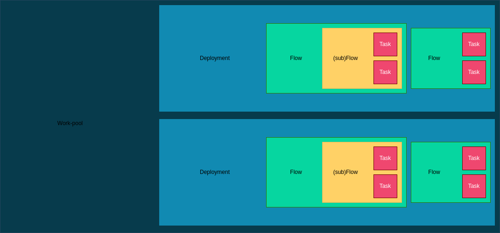

# PROJET S10 - Prefect

## Description

Prefect est un outil d'orchestration de workflow pour construire, observer et réagir aux pipelines de données.

Il permet de transformer n'importe quel fonction python en une unité de travail qui peut être observé et orchestré, à l'aide de décorateurs.

Il est possible de l'utiliser en CLI, et de se connecter soit avec l'interface Web ou une clé API.

Il permet de gérer des flows multiple simultanées et permet de visualiser un dashboard (interface web) montrant les informations des flows d'exécutions.

### Utilisation de `Work-pool`, `Deployment`, `Flow` et `Task`

Les Flows peuvent être divisés en Tasks. Mais les Tasks sont éxécutées de manière séquentielle, ce qui les rends trop différentes des jobs parralélisables. De plus, une task ne peut appeler une autre task.
Les flows sont parralélisables, et nous pouvons invoquer de multiples flows à partir d'un flow dit Master. Il est possible d'invoquer un flow avec des paramètres.

Les flows "Master" sont contenus dans des déploiements, qui sont eux-même contenus dans un work-pool.

Les "work pools" et les "workers" servent de lien entre l'environnement d'orchestration de Prefect et l'environnement d'exécution. Lorsqu'un déploiement déclenche l'exécution d'un flow, celui-ci est assigné à un "work pool" spécifique pour la planification. 

Un "worker" opérant dans l'environnement d'exécution peut alors interroger son "work pool" désigné pour rechercher de nouveaux flux à exécuter.

### Planification (Schedules)

Il permet d'automatiser la création de nouveaux flow d'exécution pour les déploiements. (Schedules utilise l'API)

### Automatisations

Possibilité de configurer des actions que Prefect exécutera automatiquement en se basant sur les événements. (event-basis triggering)

Cela peut être utile pour l'envoie de mail (avec l'utilisation de block) et de notifications sur divers plateformes comme Slack.

### Déploiement

#### Local

On peut déployer Prefect sur notre machine.

Il donne un contrôle total sur l'environnement d'exécution, mais nous devenons responsable de la maintenance du support.

#### Distant

Possibilité d'utiliser des services cloud comme AWS, Azure et même Prefect Cloud.

#### Docker

Possibilité de mettre des workflow dans des conteneurs Docker pour les déployer facilement sur les plateforme prenant en charge Docker.

### Blocks

Ce sont des éléments qui stockent une configuration pour utiliser un service exterieur comme des éléments d'AWS, d'AZURE, des JSON, des Emails, et autres. 

## Équivalence avec CiGri

Nous avons vu précédemment que nous pouvons exécuter des programmes python et les faire apparaître dans l'interface web de Prefect.

Maintenant, nous voulons savoir si Prefect pourrait remplacer CiGri, du moins pour certaines fonctionnalités. Pour cela, nous allons voir si il existe des équivalents pour les commandes `grid`, puis nous allons voir pour les types de jobs.

### Commandes grid
 
#### gridevent

Utilisation des [Automations](https://docs.prefect.io/latest/concepts/automations/) de Prefect pour configurer des triggers pour des événements de plusieurs natures:
- Changement d'état d'un flow run.
- L'état du work pool
- L'état du déploiement
- Des seuils de métrique comme la durée moyenne, la latence et la progression de l'exécution.
- Des événements customisables.

Et pour chaque événement déclenché, il est possible d'associer une action à réaliser. 

#### gridnotify

Dans les Automations de Prefect, Prefect permet de réaliser des notifications sur Discord, Email, Slack, Teams, ... (pour certains, l'utilisation du service [Sendgrid](https://sendgrid.com/en-us/pricing) est requis).

#### gridstat

Il est possible d'obtenir des informations sur un flow précis avec la commande `prefect flow-run inspect <ID>`.

De même pour le déploiement, avec la commande `prefect deployment inspect <NAME>`.

De même pour un work-pool, `prefect work-pool inspect <NAME>`.

#### griddel

En ligne de commande, il est possible d'exécuter, annuler et supprimer un flow avec la commande `prefect flow-run` + {`execute`;`cancel`;`delete`} + `<ID>`.

Nous pouvons même supprimer des flows déjà terminés (gridclean), mais pour l'instant, nous n'avons pas la notion de base de données.

De plus, pour les déploiement, nous pouvons supprimer, et modifier le déploiement avec la commande `prefect deployment` + {`apply`;`delete`}

Pour les work-pools, nous pouvons les créer, mettre à jour, supprimer, mettre en pause et les reprendre. `prefect work-pool` + {`create`;`update`;`delete`;`pause`;`resume`} + `<NAME>`

#### gridsub

Nous pouvons scheduler un flow avec `prefect deployment run '<name-flow>/<name-deployment>'`.

Et pour le lancer, `python <file.py>`.

Ou tout faire avec une seule commande: `prefect flow-run run <ID>`.

#### gridcluster

_Pas de piste intéressante_

## Campagnes et Jobs

### Propositions d'équivalence

Pour trouver les équivalents des campagnes et des jobs dans prefect, nous avons dressé un tableau de proposition (P):

| CiGri    | Prefect P1 | Prefect P2 | Prefect P3 | Prefect P4 |
| -------- | ---------- | ---------- | ---------- | ---------- |
| Campagne | Flow       | Flow       | Deployment | Work-pool  |
| Job      | Task       | (sub)Flow  | Flow       | Deployment |

Maintenant, il faut peser le pour et le contre.
    
**Prefect P1**
- Inconvénients:
    - Impossible d'interagir avec la task de façon individuelle

**Prefect P2**
- Avantages:
    - Permet d'utiliser les tasks pour avoir une décomposition plus fine
- Inconvénients:
    - Impossible de rajouter des flows (ce sont des subflows) dans un flow

**Prefect P3**
- Avantages:
    - Possibilité d'ajouter des exécutions de flows 
- Inconvénients:
    - Impossible de mettre en pause un déploiement

**Prefect P4**
- Avantages:
    - Possibilité de supprimer, mettre en pause et reprendre un work-pool

### Choix

Après beaucoup de discussions, nous sommes arrivé au point suivant: les seuls fonctionnalités qui peuvent être intéressant pour nous seraient d'utiliser Prefect comme historique, c'est-à-dire, pour chaque changement d'état sur OAR, Prefect sera informé par CiGri V4 en créant un flow dans un déploiement représentant un état, dans un work-pool associé à la campagne.

Donc, nous avons choisi d'utiliser les work-pools comme campagne, les flows comme job et utiliser les déploiements représentant les états du job sur OAR.

Pour les notifications, nous avons deux possibilités: soit nous utilisons un compte Prefect pour tout CiGri pour avoir un historique centralisé mais nous avons un problème pour l'envoie de mail individuel, soit chaque utilisateur a un compte Prefect, mais l'historique ne sera pas centralisé. 

## Conclusion

Nous avons donc envisagé d’utiliser partiellement Prefect dans CiGri en l’utilisant comme une surcouche de CiGri. Dit autrement en conservant le comportement de CiGri v3 que l’on adapte en Python en rajoutant un front end avec Prefect. Cependant, cette version rajouterait beaucoup de complexité et de contrainte pour des résultats peu probants.
En effet, cela soulève la question de comment doit être réalisé l’accès à Prefect pour l’utilisateur. Il faudrait un compte par utilisateur, le problème étant que chaque compte a le droit à seulement un workspace Prefect. Il existe une contrainte de performance, car l’implémentation imposerait de mettre à jour l’ensemble des workspaces en parallèle, sachant qu’il y en aurait autant qu’il y a d’utilisateurs. Tout cela résulterait en des performances médiocres ainsi qu’une empreinte carbone élevée.

Dans le cas où l’on choisit d’avoir un seul compte pour tout le monde, on ajouterai une très grande faille de sécurité que l’on ne peut se permettre. De plus, Prefect permet de renseigner seulement un mail par utilisateur pour les notifications, ce qui entraîne l’impossibilité d’implémenter le système de notification par mail avec Prefect.

Pour terminer, Prefect semble être mis en place pour des systèmes l’utilisant de A à Z pour en optimiser ses fonctionnalités et dans notre cas nous ne pouvons nous permettre de réimplémenter OAR. L’idée de l’utiliser partiellement semble donc peu envisageable.

Il est toutefois important de noter que des fonctionnalités premiums sont disponibles sur prefect et que nous ne nous sommes pas attardés dessus, car nous ne disposons pas de budget pour le projet. Pour ces raisons nous avons donc décidé de nous porter vers une migration plus classique du logiciel CiGri vers du Python avec l’architecture décrite dans la partie ci-dessous.

