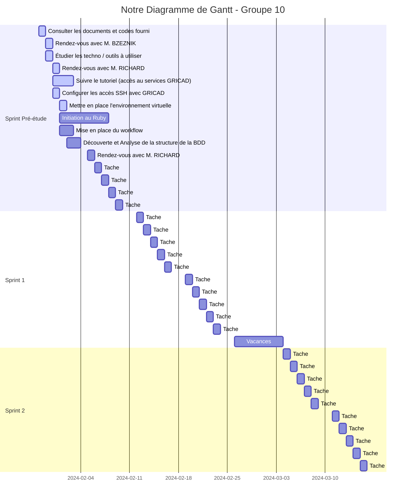

```mermaid
gantt
    title Notre Diagramme de Gantt - Groupe 10
    dateFormat YYYY-MM-DD
    section Sprint Pré-étude
        Consulter les documents et codes fourni                         :active, 2024-01-29, 1d
        Rendez-vous avec M. BZEZNIK                                     :active, 2024-01-30, 1d
        Étudier les techno / outils à utiliser                          :active, 2024-01-30, 1d
        Rendez-vous avec M. RICHARD                                     :active, 2024-01-31, 1d
        Suivre le tutoriel (accès au services GRICAD)                   :active, 2024-01-31, 3d
        Configurer les accès SSH avec GRICAD                            :active, 2024-01-31, 1d
        Mettre en place l'environnement virtuelle                       :active, 2024-02-01, 1d
        Initiation au Ruby                                              : 2024-02-01, 7d
        Mise en place du workflow                                       : 2024-02-01, 2d
        Découverte et Analyse de la structure de la BDD                 : 2024-02-02, 2d
        Rendez-vous avec M. RICHARD                        : 2024-02-05, 1d
        Tache                        : 2024-02-06, 1d
        Tache                        : 2024-02-07, 1d
        Tache                        : 2024-02-08, 1d
        Tache                        : 2024-02-09, 1d
    section  Sprint 1
        Tache                        : 2024-02-12, 1d
        Tache                        : 2024-02-13, 1d
        Tache                        : 2024-02-14, 1d
        Tache                        : 2024-02-15, 1d
        Tache                        : 2024-02-16, 1d
        Tache                        : 2024-02-19, 1d
        Tache                        : 2024-02-20, 1d
        Tache                        : 2024-02-21, 1d
        Tache                        : 2024-02-22, 1d
        Tache                        : 2024-02-23, 1d
        Vacances                        : 2024-02-26, 7d
    section  Sprint 2
        Tache                        : 2024-03-04, 1d
        Tache                        : 2024-03-05, 1d
        Tache                        : 2024-03-06, 1d
        Tache                        : 2024-03-07, 1d
        Tache                        : 2024-03-08, 1d
        Tache                        : 2024-03-11, 1d
        Tache                        : 2024-03-12, 1d
        Tache                        : 2024-03-13, 1d
        Tache                        : 2024-03-14, 1d
        Tache                        : 2024-03-15, 1d
```