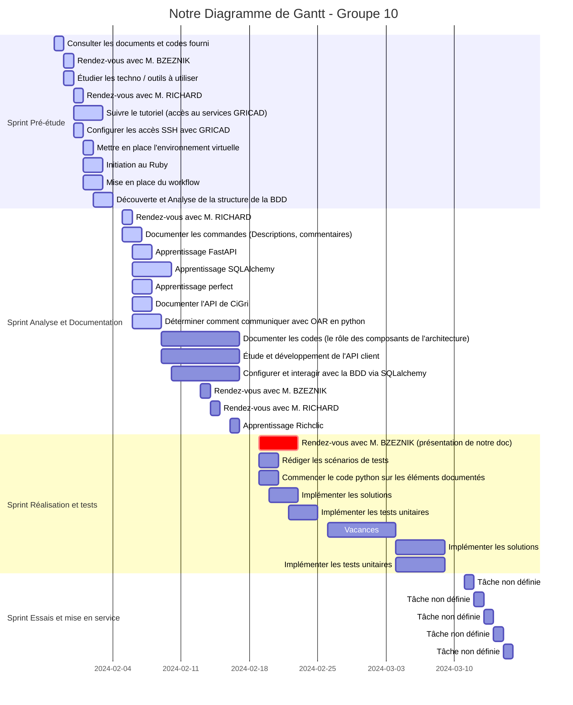

```mermaid
gantt
    title Notre Diagramme de Gantt - Groupe 10
    dateFormat YYYY-MM-DD
    section Sprint Pré-étude
        Consulter les documents et codes fourni                         :active, 2024-01-29, 1d
        Rendez-vous avec M. BZEZNIK                                     :active, 2024-01-30, 1d
        Étudier les techno / outils à utiliser                          :active, 2024-01-30, 1d
        Rendez-vous avec M. RICHARD                                     :active, 2024-01-31, 1d
        Suivre le tutoriel (accès au services GRICAD)                   :active, 2024-01-31, 3d
        Configurer les accès SSH avec GRICAD                            :active, 2024-01-31, 1d
        Mettre en place l'environnement virtuelle                       :active, 2024-02-01, 1d
        Initiation au Ruby                                              :active, 2024-02-01, 2d
        Mise en place du workflow                                       :active, 2024-02-01, 2d
        Découverte et Analyse de la structure de la BDD                 :active, 2024-02-02, 2d
    section Sprint Analyse et Documentation
        Rendez-vous avec M. RICHARD                                     :active, 2024-02-05, 1d
        Documenter les commandes (Descriptions, commentaires)           :active, 2024-02-05, 2d
        Apprentissage FastAPI                                           :active, 2024-02-06, 2d
        Apprentissage SQLAlchemy                                        :active, 2024-02-06, 4d
        Apprentissage perfect                                           :active, 2024-02-06, 2d
        Documenter l'API de CiGri                                       :active, 2024-02-06, 2d
        Déterminer comment communiquer avec OAR en python               :active, 2024-02-06, 3d
        Documenter les codes (le rôle des composants de l'architecture) : 2024-02-09, 8d
        Étude et développement de l'API client                          : 2024-02-09, 8d
        Configurer et interagir avec la BDD via SQLalchemy              : 2024-02-10, 7d
        Rendez-vous avec M. BZEZNIK                                     : 2024-02-13, 1d
        Rendez-vous avec M. RICHARD                                     : 2024-02-14, 1d
        Apprentissage Richclic                                          : 2024-02-16, 1d
    section Sprint Réalisation et tests
        Rendez-vous avec M. BZEZNIK (présentation de notre doc)         :crit, 2024-02-19, 4d
        Rédiger les scénarios de tests                                  : 2024-02-19, 2d
        Commencer le code python sur les éléments documentés            : 2024-02-19, 2d
        Implémenter les solutions                                       : 2024-02-20, 3d
        Implémenter les tests unitaires                                 : 2024-02-22, 3d
        Vacances                                                        : 2024-02-26, 7d
        Implémenter les solutions                                       : 2024-03-04, 5d
        Implémenter les tests unitaires                                 : 2024-03-04, 5d
    section Sprint Essais et mise en service
        Tâche non définie                        : 2024-03-11, 1d
        Tâche non définie                        : 2024-03-12, 1d
        Tâche non définie                        : 2024-03-13, 1d
        Tâche non définie                        : 2024-03-14, 1d
        Tâche non définie                        : 2024-03-15, 1d
```