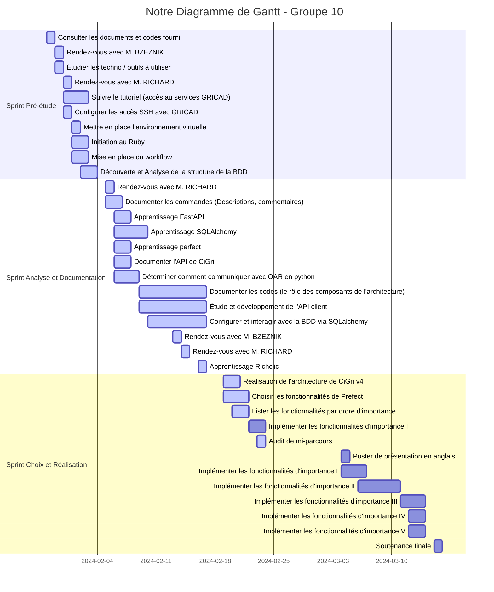

```mermaid
gantt
    title Notre Diagramme de Gantt - Groupe 10
    dateFormat YYYY-MM-DD
    section Sprint Pré-étude
        Consulter les documents et codes fourni                         :active, 2024-01-29, 1d
        Rendez-vous avec M. BZEZNIK                                     :active, 2024-01-30, 1d
        Étudier les techno / outils à utiliser                          :active, 2024-01-30, 1d
        Rendez-vous avec M. RICHARD                                     :active, 2024-01-31, 1d
        Suivre le tutoriel (accès au services GRICAD)                   :active, 2024-01-31, 3d
        Configurer les accès SSH avec GRICAD                            :active, 2024-01-31, 1d
        Mettre en place l'environnement virtuelle                       :active, 2024-02-01, 1d
        Initiation au Ruby                                              :active, 2024-02-01, 2d
        Mise en place du workflow                                       :active, 2024-02-01, 2d
        Découverte et Analyse de la structure de la BDD                 :active, 2024-02-02, 2d
    section Sprint Analyse et Documentation
        Rendez-vous avec M. RICHARD                                     :active, 2024-02-05, 1d
        Documenter les commandes (Descriptions, commentaires)           :active, 2024-02-05, 2d
        Apprentissage FastAPI                                           :active, 2024-02-06, 2d
        Apprentissage SQLAlchemy                                        :active, 2024-02-06, 4d
        Apprentissage perfect                                           :active, 2024-02-06, 2d
        Documenter l'API de CiGri                                       :active, 2024-02-06, 2d
        Déterminer comment communiquer avec OAR en python               :active, 2024-02-06, 3d
        Documenter les codes (le rôle des composants de l'architecture) :active, 2024-02-09, 8d
        Étude et développement de l'API client                          :active, 2024-02-09, 8d
        Configurer et interagir avec la BDD via SQLalchemy              :active, 2024-02-10, 7d
        Rendez-vous avec M. BZEZNIK                                     :active, 2024-02-13, 1d
        Rendez-vous avec M. RICHARD                                     :active, 2024-02-14, 1d
        Apprentissage Richclic                                          :active, 2024-02-16, 1d
    section Sprint Choix et Réalisation
        Réalisation de l'architecture de CiGri v4                       :active, 2024-02-19, 2d
        Choisir les fonctionnalités de Prefect                          :active, 2024-02-19, 3d
        Lister les fonctionnalités par ordre d'importance               :active, 2024-02-20, 2d
        Implémenter les fonctionnalités d'importance I                  : 2024-02-22, 2d
        Audit de mi-parcours                                            :active, 2024-02-23, 1d
        Poster de présentation en anglais                               : 2024-03-04, 1d
        Implémenter les fonctionnalités d'importance I                  : 2024-03-04, 3d
        Implémenter les fonctionnalités d'importance II                 : 2024-03-06, 5d
        Implémenter les fonctionnalités d'importance III                : 2024-03-11, 3d
        Implémenter les fonctionnalités d'importance IV                 : 2024-03-12, 2d
        Implémenter les fonctionnalités d'importance V                  : 2024-03-12, 2d
        Soutenance finale                                               : 2024-03-15, 1d
```